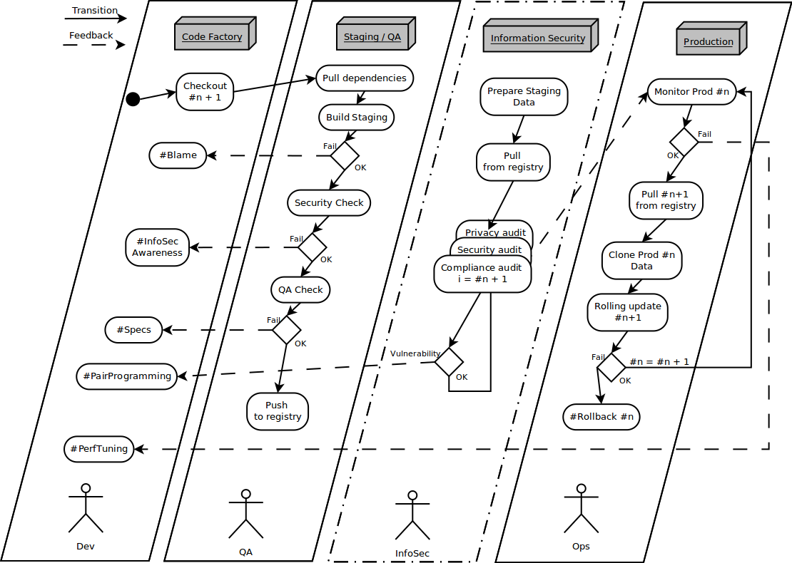

# :ambulance: ISAF (إسعاف) :ambulance:
## Integrated Security Assessments for your dev Flow
```
    EeeiiiiiEEiiiii.....                                             
       \|/                                                           
        n______     .....iiiiiEEiiiieeEE                             
       :~;     :                  \|/                                
-----;``~'  +  ;------------ ______n --------------------------------
     `-@-----@-=            :     :~:                                
=========================== ;  +  '~``; =============================
                            =-@-----@-'                              
jgs------------------------------------------------------------------

                   DEVSECOPS IN A PYTHON NUTSHELL        
```
# Purpose
This project is a "simple" python implementation of the DevSecOps Methodology, boiled down to the following picture:
[](https://insights.sei.cmu.edu/sei_blog/2014/12/security-in-continuous-integration.html)  

and an implementation attempt:  

[](https://medium.com/@H.A.T/how-to-implement-webs-hospital-b0d8b85389ce)

# Stack Deployement
You can quickly start this PoC (based on OpenFaaS) on Docker Swarm online using the community-run Docker playground: play-with-docker.com (PWD) by clicking the button below:  

[](http://labs.play-with-docker.com/?stack=https://gist.githubusercontent.com/h-a-t/eafbb19d7ce46c4ee4a541df018a5f37/raw/d1aa99f6fec38620f09ecd3a9bbfb79207cf3dde/docker-compose.yml&stack_name=func)

Or use the docker-compose.yml file.

# Prerequisite
- Get your Jupyter token:

```bash
$ docker service logs func_jupyter 2>&1 | grep token
func_jupyter.1.xam77gaqxi5s@node1    | [I 18:42:54.562 LabApp] The Jupyter Notebook is running at: http://[all ip addresses on your system]:8888/?token=5afdefee1c98acac0bbf29ae9972b7ccd23c50c115e74e49
func_jupyter.1.xam77gaqxi5s@node1    |     to login with a token:
func_jupyter.1.xam77gaqxi5s@node1    |         http://localhost:8888/?token=5afdefee1c98acac0bbf29ae9972b7ccd23c50c115e74e49
```

- Install git, unzip, curl and faas-cli in the Jupyter container:

```bash
docker exec --user root -ti func_jupyter.1.shw9s15u6co3cuzp5sjft697t bash
root@b9300915e6ad:~# apt-get update && apt-get -y install unzip git curl
root@b9300915e6ad:~# curl -sSL https://cli.openfaas.com | sh # Not cool :/
```

- Change permissions of docker.sock for the sack of this PoC. :warning: Do not do this in a production environment :bomb:

```bash
chmod 777 /var/run/docker.sock
```

- Upload ISAF.iynb to your Jupyter instance, and press play! \o/


# PoC Stack built upon:  

| Name       | Link                                       | License                   |
|------------|--------------------------------------------|---------------------------|
|    Clair   | https://github.com/coreos/clair            |        Apache License 2.0 |
| JupyterLab | https://github.com/jupyterlab/jupyterlab   |              BSD 3-Clause |
|    Klar    | https://github.com/optiopay/klar           |                       MIT |
|    Nmap    | https://github.com/nmap/nmap               |        GNU General Public |
|  OpenFaaS  | https://github.com/openfaas/faas           |                       MIT |
|  Sonarqube | https://github.com/SonarSource/sonarqube/  | GNU Lesser General Public |
|   WhatWeb  | https://github.com/urbanadventurer/WhatWeb |                     GPLv2 |
|   WPScan   | https://github.com/wpscanteam/wpscan       |             Dual-Licensed |

